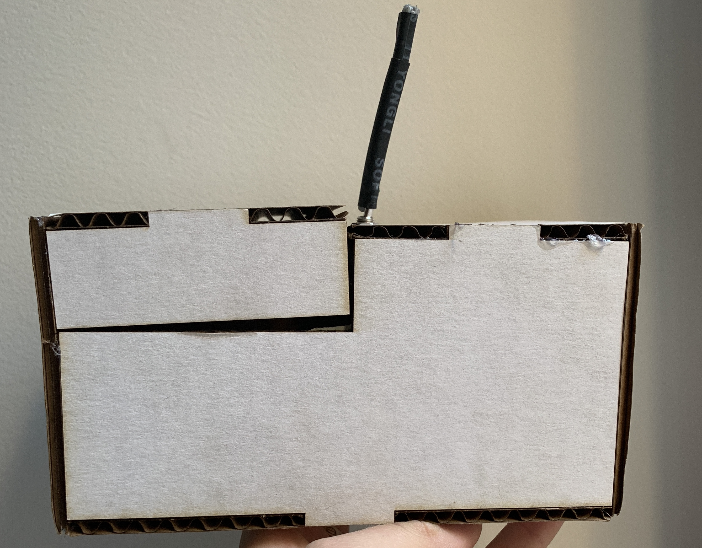

# Useless Box

## 3D Printing

**a. Include a photo of your printed part here.**

***Here are the iterations I made for my arm. The left was the first protoype, and the final product is attached on the motor.***


**b. Include `.stl` or `.svg` files for your bopper, if 3d-printing.**

[First iteration of booper file](./boop2.svg)

## Laser Cutting

**b. Include a photo of your box here.**




## Electronics

**c. Upload code & a photo of your electronic circuit here.**


(https://youtu.be/gwqkft8TaS8)

## Putting it All Together

Include here:
1. Your Arduino code.

```
#include <Servo.h> 

// Sweeper is a simple wrapper class for Servo that toggles a servo between two predetermined positions.
class Sweeper
{
  
private:
   Servo servo;
   static const int closedPos = 180;
   static const int openPos = 90;

public: 
  // constructor
  Sweeper() {}

  // Tell us the pin number is the servo control wire attached to.
  // Attach will set the pin to OUTPUT for pwm control of a servo.
  void Attach(int pin)
  {
    servo.attach(pin);
  }
  
  void Detach()
  {
    servo.detach();
  }

  // reset the servo position to our initial state
  void Reset()
  {
    servo.write(closedPos);
  }

  // set the servo to its "open box" position.  this should move the attached
  // servo arm enough to open the box and trigger the toggle switch back to off,
  // which will tell our servo to return to its initial postion.
  void Activate()
  {
    servo.write(openPos);
  }
};

Sweeper myServo;

//volatile bool switchChanged = false;  // this flag is used to send switch state info to the serial port
volatile int previousSwitchState = LOW;

void setup()
{
  //Serial.begin(9600);
  //Serial.println("Useless Box Lab 5");
  
  myServo.Attach(10);
  myServo.Reset();

  pinMode(2, INPUT); 

  // this line causes the ToggleSwitch() interrupt service routine to be called if the state of pin 2 changes
  attachInterrupt(digitalPinToInterrupt(2), ToggleSwitch, CHANGE);
}

// this is called when the input on pin 2 changes (LOW to HIGH *or* HIGH to LOW)
void ToggleSwitch()
{
  int switchState = digitalRead(2);
    
  if (switchState != previousSwitchState)
  {
    //switchChanged = true; // look for this flag in loop() in order to send state info to the serial port.
    if (switchState == HIGH)
      myServo.Activate();
    else
      myServo.Reset();

    previousSwitchState = switchState;  // remember that the switch state has changed
  } 
}
  
void loop()
{ 
}
```
1. `.stl` or `.svg` files for your "bopper" — if you use some other technique, include the respective supporting material.
1. At least one photo of your useless box taken in the MakerLab's Portable Photo Studio (or somewhere else, but of similar quality).
1. A video of your useless box in action.

(https://youtu.be/Xz3YT5VJaF4)
